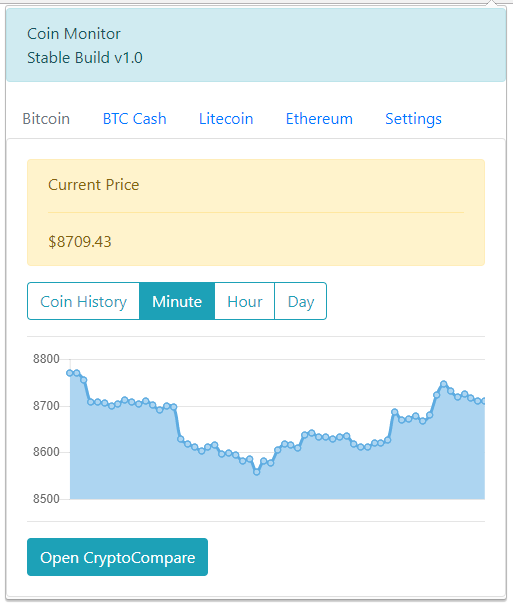

# CoinMonitor

CoinMonitor is a chrome extension for checking cryptocurrency prices quickly. Check their current price and their price history measured in days, hours, or minutes.

> This extension is not affiliated with CryptoCompare.com
